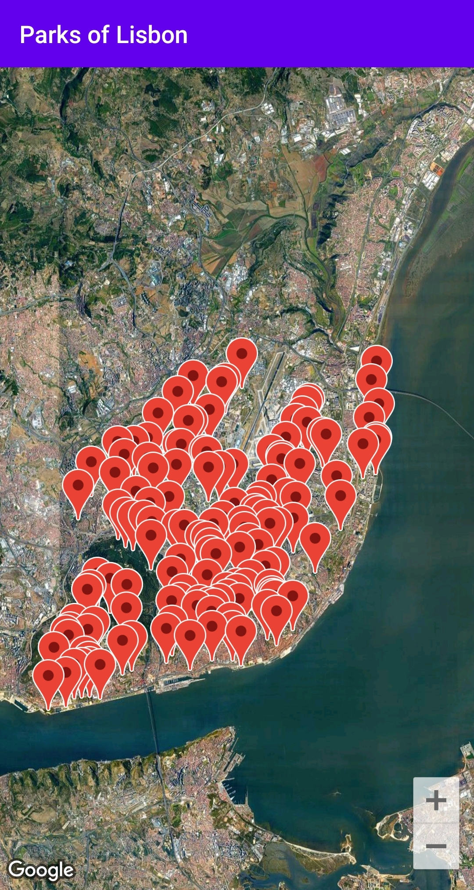
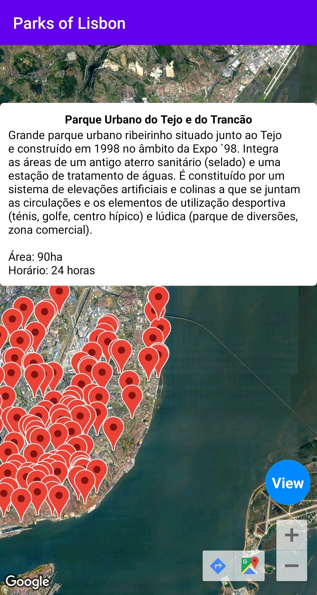
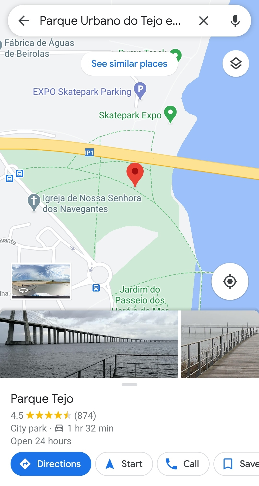

<h1 align="center">
  
</h1>

<h2 align="center">
  Parks of Lisbon
</h2>

Parks of Lisbon is a project created by Bruno Ponte. This app shows information about all the parks in the city of Lisbon.

  

  

  

Download it now!

  

 

  
  
  

